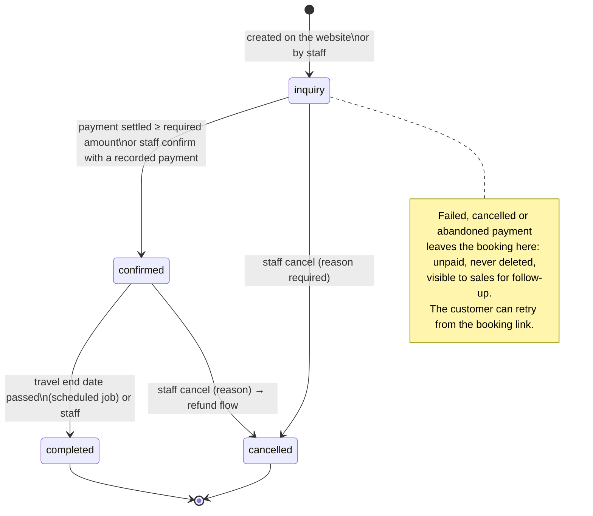
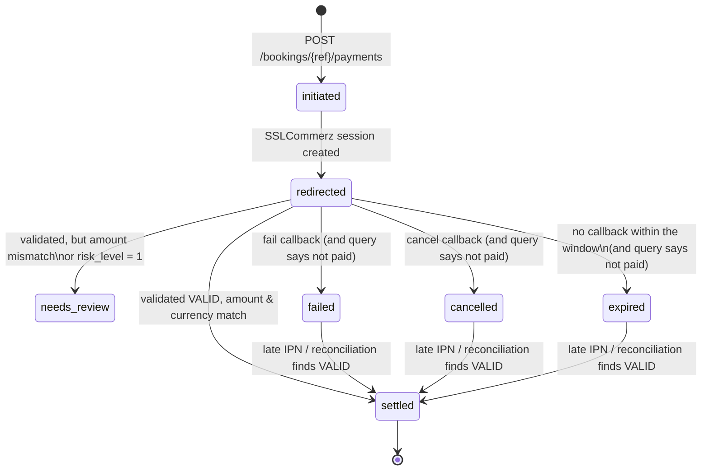
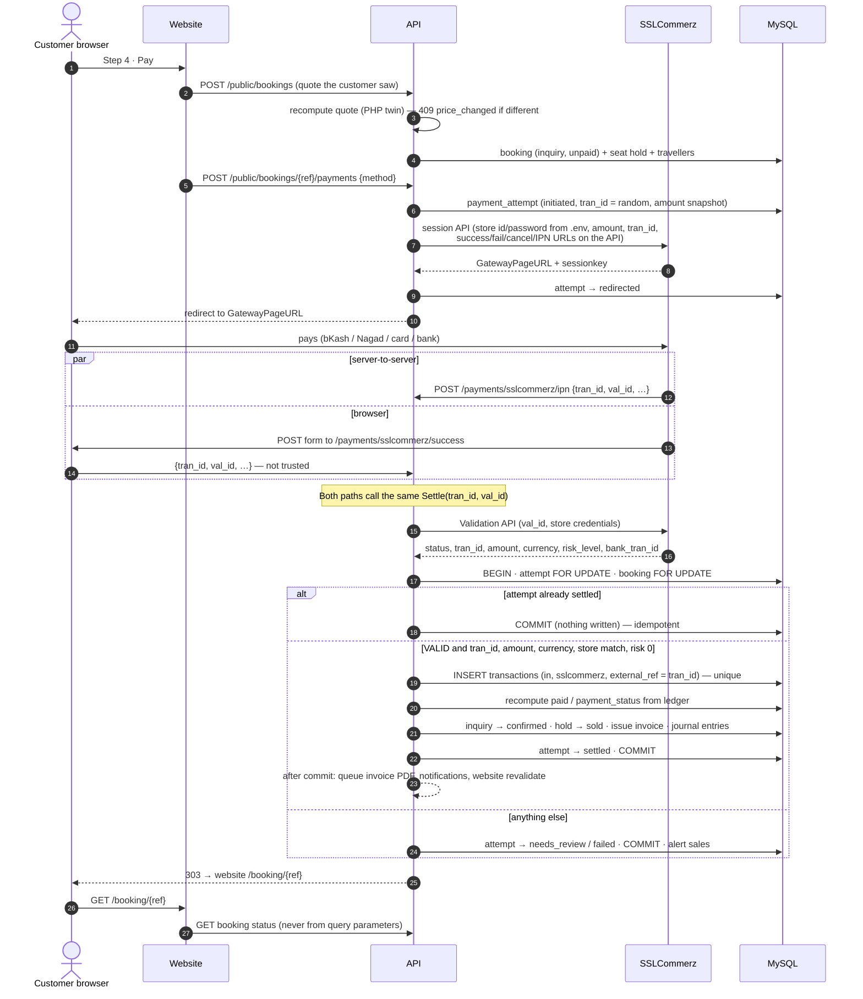

# Phase 3 — booking, SSLCommerz and invoices

**Status (2026-09-13): built and tested locally (§0).** The four questions in §9 were answered on 2026-09-13 and are
built as approved. Not yet deployed: the VPS needs Chrome for Testing for PDFs (§0.5), and live payments need the
client's SSLCommerz API credentials.

## 0. As built

### 0.1 What runs where

| Piece | Code |
|---|---|
| Pricing, one formula everywhere (discount first, then VAT/service charge) | `@bhabaghure/pricing` `quoteBooking` / `invoiceTotals` / `paymentStatus`, PHP twin `App\Support\Pricing\PricingService`, both held to `packages/pricing/fixtures.json` |
| Booking creation (price recheck → 409 `price_changed`, seat hold under a departure row lock, guest token) | `App\Services\Booking\BookingCreator`, `POST /public/bookings` |
| Status changes (inquiry → confirmed → completed; cancel) | `BookingStateMachine` only — the model refuses any other status write (`WriteScope`) |
| Money | `LedgerService` only: issue posts Dr AR · Cr Sales · Cr VAT payable; a payment writes the cash book and Dr cash/bank/wallet/SSLCommerz · Cr AR; paid and PAID/PARTIAL/UNPAID are recomputed from the cash book. Reversals, never edits |
| Invoice snapshot, numbers, void | `InvoiceIssuer` (`INV-0001`, booking refs `BH-2609-001` from `DocumentNumbers`) |
| SSLCommerz | `PaymentService` (`start`, idempotent `settle`, `closeUnpaid`, `reconcile`), gateway interface with `HttpSslCommerzGateway` (sandbox/live) and `FakeSslCommerzGateway` (local and e2e only) |
| Passport OCR | `PassportScanner` → `PassportTextReader` (`TextractPassportTextReader`, `UnavailablePassportTextReader`) → `MrzParser` (ICAO 9303 TD3, check digits) |
| Invoice print view and PDF | `resources/views/invoices/invoice.blade.php` (mm layout), `InvoicePdf` → `packages/pdf/src/render.mjs` (headless Chrome, bundled fonts); `Code128` SVG |
| Admin | Bookings list and detail: draft quote controls (live totals from `@bhabaghure/pricing`), invoice preview with header on/off, Print, PDF, Issue, Void, Record payment, Reverse, Confirm / Complete / Cancel |
| Website | Modal steps 1–4, passport scan upload with "please confirm" fields, payment step, `/booking/{reference}` return page, draft `/terms`, `/privacy`, `/refund-policy` |
| Scheduled | `payments:reconcile` every 10 min · `bookings:complete-travelled` daily 02:30 Dhaka · `passport-scans:prune` hourly |

### 0.2 Endpoints added

| Method and path | Who | What |
|---|---|---|
| `POST /public/bookings` | anyone (10/min, 100/day per IP) | Creates an unpaid inquiry; answers the private `accessToken` once. 409 `price_changed` (with the new quote) or `seats_unavailable` |
| `GET /public/bookings/{reference}` | `X-Booking-Token` or the owning customer | Status, lines, totals, paid, invoice links. Never passport data. Same 404 for "no such booking" and "not yours" |
| `POST /public/bookings/{reference}/payments` | same | `{method: bkash|nagad|card|bank, expected_total}` → `{redirectUrl, amount, charge, total}`: SSLCommerz is asked for exactly the total the customer saw (balance + online payment charge), or 409 `price_changed` |
| `POST /public/passport-scans` | anyone (20/min) | JPEG/PNG/PDF ≤ 5 MB → `{token, status: read|partial|unavailable, fields}` |
| `GET /public/invoices/{token}` · `/pdf` | share link | Issued invoice, passport numbers masked |
| `POST /payments/sslcommerz/ipn` · `success` · `fail` · `cancel` | SSLCommerz / the customer's browser | Everything re-checked with the Validation or transaction-query API; browser callbacks 303 to `WEB_URL/booking/{reference}` |
| `GET /admin/bookings` · `/{id}` | `bookings.view_all`, or `view_own` (assigned or created by me) | List and detail with the actions this staff member may take |
| `PUT /admin/bookings/{id}/quote` | `bookings.update` | Travellers, room, VAT rate (0/2/5/7.5/15), discount — before the invoice is issued; checked against the admin's total |
| `POST /admin/bookings/{id}/invoice` · `POST /admin/invoices/{id}/void` | `invoices.manage` | Issue (idempotent) · void with a reason (reversing journal entry) |
| `GET /admin/bookings/{id}/invoice/print` · `/pdf` | booking viewers | `?header=0|1&lang=bn|en`; a preview before issue |
| `POST /admin/bookings/{id}/payments` · `POST /admin/transactions/{id}/reverse` | `transactions.create_manual` | Record payment (amount, method, reference, date) · reverse with a reason |
| `POST /admin/bookings/{id}/confirm` · `complete` · `cancel` | `bookings.update` | Confirm needs money on the books; cancel needs a reason |

### 0.3 Verified by

- **API (PHPUnit, MySQL):** `BookingLedgerTest` (price recheck, derived status, balanced journal, reversals, snapshot,
  seat holds, completion job), `SslCommerzPaymentTest` (idempotent settle across redirect + IPN + retries, forged and
  foreign `val_id`, amount below expected → review, convenience fee as income, fail/cancel keep the inquiry and free
  seats, late VALID after a fail still credits, reconciliation, IPN signature, live refused outside production, CORS
  for the token header), `PassportScanTest` + `MrzParserTest` (ICAO specimen, a misread digit flagged, Textract error
  → unavailable, encrypted storage, pruning), `InvoicePdfTest`, `AdminBookingTest`, `Code128Test`, `NumeralsTest`.
- **Invoice print output, measured on the PDF:** with the header off the top 48 mm (6 mm margin + 42 mm block) of the
  rasterised page has zero non-white pixels, and every text run below it is at the same x/y (±0.01 mm) as with the
  header on; the Code 128 is decoded from the rasterised page (ZXing) back to the invoice number; renaming the package
  and changing its price after issue leaves the PDF text identical.
- **Website e2e (Playwright, real API + SSLCommerz stand-in):** book → scan upload ("type manually" path) → review →
  pay → return page shows paid with invoice links; a stranger without the token sees nothing; a cancelled payment keeps
  the unpaid inquiry and paying again from the booking page works.
- **Admin e2e:** draft quote with VAT after discount, issue, header off empties the letterhead block in the preview,
  half-advance payment → PARTIAL on the screen and on the invoice, confirm.

### 0.4 Decisions applied and things to know

- **The price shown is the price paid — including the gateway fee** (decided 2026-09-13). The client's SSLCommerz
  *payment-link* page adds a "convenience fee" at the gateway; that must never happen on the booking path.
  - **Sandbox run (2026-09-13, SSLCommerz public sandbox store `testbox`, through this code end to end):** the checkout
    showed "PAY 153,000 BDT" on the card and mobile-banking tabs; the test card was charged 153,000.00; the validation
    API returned `amount` 153000.00 and `store_amount` 149175.00. SSLCommerz's fee (**2.5%** here) came out of the
    merchant settlement, not the customer. The client's own store rate and fee bearer are set per store by SSLCommerz:
    **confirm with SSLCommerz that the API store is "merchant bears the fee"** (no convenience charge added at checkout).
  - **Online payment charge** (Pricing screen, `onlinePaymentChargePercent`, default **0**): if the company wants to pass
    the cost on, it appears as its own line — "অনলাইন পেমেন্ট চার্জ · Online payment charge" — on the review and payment
    steps and on the booking page, and the grand total includes it. `@bhabaghure/pricing` `onlinePayment()` and its PHP
    twin compute it from the same fixtures. Either outcome (company absorbs / customer pays a line) is a settings change.
  - **Enforced:** `POST /public/bookings/{ref}/payments` takes the `expected_total` the customer saw and refuses (409
    `price_changed`) if it differs; SSLCommerz is asked for exactly that total. On settlement the booking gets its
    amount, the charge is income (4100), the gateway's fee is an expense (5100, from `store_amount`), and the SSLCommerz
    clearing account expects what will actually be settled. If SSLCommerz ever collects more than was shown, the payment
    still counts but is flagged `gateway_surcharge` in the audit log and the admin, for a refund and a store fix.
  - Online (SSLCommerz) payments can't be reversed from the admin; they are refunded through the gateway (refund
    workflow is a later phase).
- **SSLCommerz tests use documented response shapes** plus the one real sandbox run above. Card tokens in the
  validation response (`token_key`, `card_ref_id`) are not stored.
- **Nagad** has no `multi_card_name` of its own in the SSLCommerz docs; the payment page opens on mobile banking.
- **Card data never touches the site**; the IPN signature is a filter only — money is credited after validation.
- **Guest booking link:** the token sits in `sessionStorage` for the return from SSLCommerz and in a `#t=` fragment on
  the private link (fragments aren't sent to servers or logs). A guest booking is linked to the customer record for
  that phone number (created as a lead if new); the customer portal that would show it arrives later.
- **Passport OCR** is off (`PASSPORT_OCR_PROVIDER=none`) until the client has an AWS account: scans are still stored
  (encrypted, 24-hour expiry unless booked) and travellers type the details. With Textract on, only the MRZ is trusted;
  a field whose check digit fails is shown as "please confirm" and the traveller must confirm or correct it.
- **Invoices:** the letterhead is the company's current details from site settings; everything billed comes from the
  snapshot. Header height is 42 mm (`config/bhabaghure.php`, overridable by an `invoice.headerHeightMm` site setting).
  Share links mask passport numbers; staff prints show them in full. Invoice terms are the prototype's wording.
- **Legal pages are drafts** for the company's lawyer: a visible banner, `noindex`, and `[CLIENT TO CONFIRM]` markers
  (`web/src/features/legal/documents.ts`, `LEGAL_STATUS`). The booking stores `terms_version = draft-2026-09`.
- **Early bird / last-minute / season rules** are not built (decision 3). `_design` in this workspace is still the
  08:13 copy — the prototype fix (rules off by default, "rate not yet confirmed by client") has not reached it.

### 0.5 Deploy notes

VPS (Ubuntu 24.04.4, 2 CPUs, 7.9 GB RAM, 15 GB disk free): all shared libraries Chrome needs are present; no Bengali
fonts are needed (PDFs embed theirs). Node 22, PHP 8.3, Composer, MySQL 8.0 are there. The app itself is not deployed
yet (`/var/www/Bhabagure` held nothing before today).

Installed on 2026-09-13 (approved):

- **Chrome for Testing 153.0.8010.36**, headless-shell build, unpacked in
  `/var/www/Bhabagure/tools/chrome-for-testing/153.0.8010.36/` with a `current` symlink (261 MB; no system packages;
  `ldd` finds every library). Checked as `www-data` with the sandbox on: printed a PDF with Bengali text and wrote
  nothing outside the project. Set `PDF_CHROME_PATH=/var/www/Bhabagure/tools/chrome-for-testing/current/chrome-headless-shell-linux64/chrome-headless-shell`.
  The renderer points Chrome's HOME, TMPDIR and caches at `storage/app/private/chrome`. `/tools/` is git-ignored.
- **`bhabaghure-scheduler.service` + `.timer`** in `/etc/systemd/system` (sources in `deploy/systemd/`), verified with
  `systemd-analyze verify`, **left disabled** until the API is deployed (it runs `php artisan schedule:run` every minute
  as `www-data`). At deploy: `systemctl enable --now bhabaghure-scheduler.timer`.

### 0.6 Refresh-token grace window (2026-09-13)

A reload while a session refresh is in flight used to sign staff out (the reused refresh cookie looked like theft).
Now a token rotated within `AUTH_REFRESH_REUSE_GRACE_SECONDS` (default 10), presented again by the **same IP and user
agent** that rotated it, returns the same successor token (derived with an HMAC of the old one, so nothing is stored in
the clear); several quick rotations are followed to the newest. Replays later, or from another device or IP, still
revoke the whole sign-in. Signed-out sessions are never revived. Covered by `AuthTest` and the admin e2e reload test
(which fails with the grace window set to 0).

---

Sources, re-read today (all `_design` files dated 2026-09-13 08:13): `README.md` (booking modal, invoice, integrations),
`Bhabaghure Website.dc.html` (booking steps, payment step, FAQ), `Bhabaghure Invoice.dc.html` (in full),
`Bhabaghure Admin.dc.html` (Pricing & seats, Payments, Accounting journal), `DEPLOYMENT.md`.

---

## 1. What the re-synced design changes or contradicts

| # | Finding | Proposed handling |
|---|---|---|
| 1 | **Pricing screen now separates the single-room supplement from the slab** ("+12% · applies only when single occupancy is chosen", Sharing / Single room chips). | Matches what is built. No change. |
| 2 | **The same calculator adds more rules, on by default:** early bird −6% (60+ days), last-minute −10% (≤ 10 days), peak season +15% (Oct–Jan), low season −5%. It also applies percentages to the *base* fare and adds them, so a group in single rooms gets `base × (1 − 6% + 12%)`, while the website charges `base × 0.94 × 1.12`. | If these rules applied only at booking, the card and the booking would disagree — the defect you named. **Question 3.** |
| 3 | **Invoice prototype applies discount after VAT** (`total = base + addons + vat − discount`); the admin quote screen applies it before (`vat = (sub − disc) × 2%`). | One invoice formula for every screen: service charge / VAT on *(subtotal − discount)*. Put it in `@bhabaghure/pricing` with a PHP twin, both tested against the same fixtures. |
| 4 | **Invoice "Paid (৳)" is a typed field with quick-set chips** (fully paid / half advance / nothing). The pill is derived from the amounts, as you require. | Paid can't be a typed number on a real invoice — it must equal the ledger, or money has two sources. The chips become **Record payment** (amount pre-filled: full / half / custom), which writes a ledger entry; paid, balance and pill follow from it. Part of **question 1**. |
| 5 | **"Every issued invoice auto-credits the company ledger."** The `transactions` table is the cash book — money that actually moved. The admin Accounting prototype's journal shows invoice issue as *Dr Accounts receivable · Cr Tour package sales* and payment as a separate entry. | Crediting the cash book at issue would count the money twice (once at issue, once when paid). Proposed: issue posts an append-only **journal** entry (receivable/sales); payments post to the cash book *and* the journal. **Question 1.** |
| 6 | Invoice VAT select 0 / 2 / 5 / 7.5 / 15% is labelled "Service charge & VAT"; the website charges a 2% service charge. | Same number: the invoice's rate defaults to the service-charge setting. NBR Mushak-6.3 compliance is still open (Phase 1 open item 11). |
| 7 | The prototype barcode is decorative (bar widths from character codes). | Real **Code 128** of the invoice number including the hyphen (`INV-0412`), rendered as SVG. 1-D USB scanners — the usual office kind — read it; QR would need a camera scanner. |
| 8 | Prototype step 3 shows pay methods bKash / Nagad / Card / Bank; SSLCommerz hosts all four. | The choice is passed to SSLCommerz so its page opens on that method; the customer can still switch there. |
| 9 | Prototype confirmation says "invoice emailed … SMS reminder 48 hours before". | Email needs SendGrid (not yet configured) and SMS/WhatsApp is Phase 4. The confirmation shows the invoice link now; sending hooks are queued jobs that log locally until the providers exist. |

---

## 2. Booking flow on the website

Four steps, as the brief says, plus the return page:

1. **Package & travellers** — package, date (or departure), travellers, room (twin / triple / single), add-ons.
2. **Traveller details** — per traveller: passport scan upload → OCR auto-fill → editable fields (§5).
3. **Review** — every line and the total, terms and cancellation policy consent.
4. **Payment** — method choice → "Pay with SSLCommerz" → creates the booking and redirects.
5. **Return page** `/booking/{reference}` — reads the booking's status *from the API* and shows paid, pending
   or "payment didn't complete — try again or contact us".

**One price, every screen.** Cards, detail modal and steps 1–4 all call `@bhabaghure/pricing`. When the booking is
created the API recomputes the quote with its PHP twin (same fixtures file) from *current* package, slab and add-on
data, and compares it with the total the customer was shown. If they differ (a price changed in the CMS while the
modal was open) it answers **409 `price_changed`** with the new quote; the modal shows the new total and asks again.
The customer is never charged an amount they didn't see.

A guest can book without an account. The booking is linked to the customer record for that phone number (created as
a lead if new); this exposes nothing to the guest. They receive a private link to the booking (a signed token, like
the unsubscribe link).

---

## 3. Booking state machine

Two independent things change on a booking: **where it is in the trip** (`status`) and **how much is paid**
(`payment_status`). Only the first is a real state machine; the second is always *derived*.



| Rule | How it's enforced |
|---|---|
| Only these transitions exist; `completed` and `cancelled` are final | `BookingStateMachine::transition()` is the only code that writes `status`; any other change is refused by a model guard. Each transition stamps `confirmed_at` / `completed_at` / `cancelled_at` and writes an audit row. |
| `payment_status` is never set by hand | Derived inside `LedgerService` from the ledger: `paid = Σ in − Σ out` for the booking. `unpaid` at 0, `paid` when `paid ≥ total`, `partial` between, `refunded` when payments exist and net paid is 0 after refunds. No endpoint or form accepts it. |
| `paid_amount` is a cache that can't drift | Recomputed from the ledger sum (never incremented) with the booking row locked, in the same DB transaction as the ledger row; a scheduled check compares it with the ledger and alerts on any difference. `due_amount` is a generated column. |
| Seats can't be oversold | For departures with seats, creating a booking locks the departure row, checks `seats_total − confirmed − active holds`, and places a **hold** that expires with the payment window (default 45 minutes). Settled payment turns the hold into a sold seat; expiry or failure releases it. |
| Confirmation issues the invoice | `inquiry → confirmed` issues the booking's invoice from the snapshot (§6) in the same transaction. |

**Payment attempts** have their own small lifecycle. A booking can have several (a failed try, then a successful one).
Attempts are mutable operational records; the money itself is only ever in the append-only ledger.



`settled` is final and is the only state that credits money. A later "fail" for a settled attempt is ignored. The
reverse is allowed: if money *was* taken after a fail or expiry, it is credited — the customer paid.

---

## 4. Payment callback flow (SSLCommerz)



**Why a retry can't double-credit — four independent guards:**

1. `Settle()` locks the attempt row and returns immediately if it's already settled. The IPN and the browser redirect
   can arrive together or be retried many times; only the first commit writes.
2. `transactions` has a unique key on `(method, external_ref)`, and `external_ref` is the `tran_id`. Even if two
   processes somehow both passed step 1, the second insert fails and its transaction rolls back.
3. `paid_amount` is recomputed from the ledger sum, never incremented, so a replayed update can't add twice.
4. A scheduled reconciliation compares every booking's cached `paid_amount` with its ledger sum and alerts on any
   difference.

**Never trusting the redirect.** The success, fail and cancel POSTs carry only `tran_id` / `val_id` that the API then
checks with SSLCommerz's Validation API (and, for fail/cancel/expiry, the transaction-query-by-`tran_id` API). The
amount credited is the attempt's own snapshot, confirmed by SSLCommerz — never a posted value. IPN signatures
(`verify_sign`) are checked first as a cheap filter, not as proof.

**Failure and abandonment.** Fail or cancel → attempt `failed` / `cancelled` (after the query API confirms nothing was
taken), hold released, booking stays `inquiry` + `unpaid`, sales alert. No callback → a job every 10 minutes queries
SSLCommerz for attempts past their window: paid → settled; not paid → `expired`, hold released. The booking is never
deleted; the booking link offers "try payment again", which creates a new attempt.

**Sandbox and live.** `.env`: `SSLCOMMERZ_MODE=sandbox|live`, `SSLCOMMERZ_STORE_ID`, `SSLCOMMERZ_STORE_PASSWORD`.
The mode selects the gateway hosts; `live` is refused unless `APP_ENV=production`. Callback URLs point at the API
host. SSLCommerz can't reach `localhost`, so automated tests replay recorded sandbox responses; a manual sandbox run
needs a public tunnel to the local API (your call when we get there). Endpoint details are checked against the
SSLCommerz developer documentation during implementation.

---

## 5. Passport upload and OCR

```
Traveller card ─ upload (JPEG/PNG/PDF ≤ 5 MB) ─▶ POST /public/passport-scans
                                                   │ encrypted file on the private disk, 24-hour expiry
                                                   │ PassportReader (provider behind an interface, 10 s timeout)
                                                   │   → text / fields → MRZ parser with check digits
                                                   ▼
                     { status: read | partial | unavailable, name, passportNumber, expiry, dob?, nationality? }
```

- **Degrades gracefully by design:** no provider configured, provider error, timeout, unreadable MRZ or failed check
  digits → `unavailable` or `partial`. The fields stay editable, a short note says "fill in manually", and the booking
  never waits on OCR. OCR-filled fields are marked so the traveller checks them.
- **Trust the MRZ, check it:** passport number, expiry and date of birth come from the machine-readable zone and must
  pass their ICAO check digits; otherwise they are not auto-filled.
- **Privacy:** scans are encrypted at rest, never public, attached to the traveller when the booking is created,
  and deleted after 24 hours if no booking uses them. The scan token is single-use and tied to the uploading session.
  A consent line sits under the upload.
- Provider: **question 4**.

---

## 6. Invoices

**Snapshot, not live data.** Issuing copies everything printed — billed-to, package code and title, travel dates,
travellers and passport numbers, line items, rates, discount, VAT rate, totals — into the invoice row and its lines
(already frozen after issue by `Invoice::SNAPSHOT_COLUMNS`). The HTML, the print view and the PDF render **only** from
those columns. A test renames the package and changes its price after issue and asserts the PDF is unchanged.

**Numbers.** `INV-0001…` from `document_sequences` under a row lock; booking references `BH-YYMM-NNN` the same way.

**Live totals (draft invoices).** Travellers stepper, VAT rate and discount recalculate lines and totals through the
shared formula (§1 row 3). Paid, balance due and the pill come from the ledger: **PAID** when balance ≤ 0,
**UNPAID** when nothing is paid, **PARTIAL** otherwise. No control sets the status. Once issued, the invoice is frozen;
corrections are void-and-reissue.

**Header on/off — measured on the print output.** The header block has a fixed height in millimetres
(`invoice.header_height_mm`, a site setting, default the height of the printed header). On: logo and company details
fill it. Off: the same block is empty, so *everything below starts at exactly the same position on the page* and the
client's pre-printed pad header sits in that space. Verified by rendering both PDFs and asserting: (a) the vertical
position of "Billed to" and of every line item is identical in both, and (b) with the header off, the region above the
block contains no ink (checked on a rasterised page, not the screen).

**Barcode.** Code 128 set B with checksum, as inline SVG (sharp in print). Verified by decoding the rasterised PDF
with a barcode reader in the test suite, not only by unit tests of the encoder.

**PDF.** Rendered server-side from the same HTML/print CSS with headless Chrome (best Bangla text shaping; PHP-only
PDF libraries break Bengali conjuncts), queued, stored on the private disk, regenerated only by void-and-reissue.
Needs Chrome's system libraries on the VPS — to be checked read-only before deploy; if they're missing, that becomes
a server question for you, since installing system packages on the shared box is not allowed without asking.

**Where invoices appear:** admin booking detail (preview with header toggle, Print, PDF, Record payment, Issue, Void);
the customer's share link `customer.bhabaghure.com.bd/invoice/{token}`; the website booking page ("Download invoice").

---

## 7. Legal pages (drafts)

`/terms`, `/privacy`, `/refund-policy` in Bangla and English, drafted from the prototype's FAQ and invoice terms:
21-day cancellation, non-refundable air-ticket and hotel portions, visa processing fee non-refundable, passport
six-month validity, card data never stored (SSLCommerz), passport scans encrypted and retention stated.

They are **drafts**: every page carries a visible "Draft — pending review by the company's lawyer" banner and
`noindex` until an admin marks them approved (a site setting). Points the prototype doesn't settle are marked
`[CLIENT TO CONFIRM]` — e.g. what happens when cancelling within 21 days, refund timelines, which fees are
non-refundable, governing law and dispute venue.

---

## 8. Data model additions

| Table / columns | Purpose |
|---|---|
| `bookings` + `room_type`, `single_supplement_amount`, `service_charge_percent`, `addons_amount`, `locale`, `terms_accepted_at`, `terms_version`, `access_token_hash` | Full quote snapshot; guest booking link |
| `booking_addons` | Add-on snapshot per booking: code, bn/en name, unit, unit price, quantity, amount |
| `seat_holds` | `departure_id`, `booking_id`, `seats`, `expires_at`, `released_at` |
| `payment_attempts` | `booking_id`, `gateway`, `tran_id` (unique), `amount`, `currency`, `method_hint`, `status`, `session_key`, `val_id`, `bank_tran_id`, `card_type`, `risk_level`, `validated_at`, `expires_at`, `gateway_response` (JSON, secrets stripped) |
| `passport_scans` | `token_hash`, encrypted `path`, `mime`, `bytes`, `ocr_status`, encrypted `ocr_result`, `booking_traveller_id`, `expires_at`, `ip` |
| `accounts`, `journal_entries`, `journal_lines` (append-only, balanced) | Only if question 1 is answered "journal": receivable/sales on issue, bank/receivable on payment |
| `invoices` + `header_height_mm` is a setting, not a column | Print option only |

---

## 9. Questions

1. **Ledger on invoice issue.** Recommended: issue posts an append-only **journal** entry *Dr Accounts receivable ·
   Cr Tour package sales* (as in the admin Accounting prototype); a payment posts to the cash book *and* the journal
   (*Dr SSLCommerz/bank · Cr Accounts receivable*). Paid amount on the invoice then always equals the ledger, and the
   prototype's "Paid (৳)" control becomes "Record payment". Alternative: credit the cash book at issue — not
   recommended, it counts money that hasn't arrived and double-counts when it does.
2. **How much is paid online?** Recommended: **full amount** online in Phase 3 (the prototype's payment step charges
   the total); advances and instalments are recorded by staff as payments against the invoice. Alternative: allow an
   advance online (e.g. 30%, set in Pricing), confirming the booking on the advance.
3. **Early bird, last-minute and season rules** from the Pricing screen. Recommended: **not in Phase 3** — keep slab +
   single room + add-ons + service charge, which is what every screen shows today. Adding date-based rules later means
   putting them into the shared pricing service and showing them on the cards once a date is chosen, with rates the
   client confirms. Alternative: build them now into the shared service.
4. **OCR provider.** Recommended: **AWS Textract `AnalyzeID`** (purpose-built for passports; returns the MRZ fields;
   available in the Mumbai region). Alternative: Google Cloud Vision (general OCR; we parse the MRZ from its text).
   Either way it needs the client's cloud account and keys in `.env`; until then OCR reports "unavailable" and fields
   are typed manually. Does the client have an AWS or Google Cloud account?

## 10. Build order after the answers

1. PHP pricing twin + shared invoice formula (fixtures), document numbers, booking state machine, `LedgerService`.
2. Booking creation API (price check, seat holds, guest token) and the website steps 1–3 wired to it.
3. Passport scan upload + MRZ parser + provider adapter (null adapter first).
4. Invoice snapshot, HTML/print, Code 128, PDF, header measurement tests, admin booking detail and invoice actions.
5. SSLCommerz: session, callbacks, `Settle()`, reconciliation job — sandbox, recorded responses in tests.
6. Website step 4 and return page; legal page drafts.
